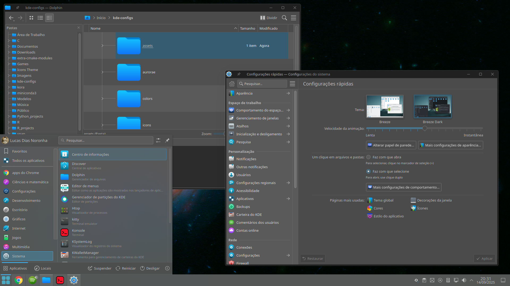

# KDE Configurations

Este repositório contém minhas configurações personalizadas do KDE Plasma, incluindo **Color Schemes**, **Window Decorations (Aurorae)** e **Icon Themes**. Facilita reinstalar ou compartilhar com outra máquina.




## Estrutura do repositório
```
kde-configs/
├─ colors/ # Color schemes
├─ aurorae/ # Window decorations
└─ icons/ # Icon themes
```

---

## Instalação

### 1. Color Schemes

Copie os arquivos `.colors` para a pasta correta do KDE:

```bash
mkdir -p ~/.local/share/color-schemes
cp -r colors/* ~/.local/share/color-schemes/
```

Depois, vá em: Configurações → Aparência → Esquema de cores e selecione o que quiser.

### 2. Window Decorations (Aurorae)

Copie os temas para a pasta certa:

```bash

mkdir -p ~/.local/share/aurorae/themes
cp -r aurorae/* ~/.local/share/aurorae/themes/
```

Depois, abra: Configurações → Aparência → Decoração de Janelas e aplique o tema desejado.

Se o tema não aparecer imediatamente, force a atualização do cache do KDE:

```bash
kbuildsycoca5
```

### 3. Icon Themes

Copie os ícones para a pasta do usuário:

```bash
mkdir -p ~/.local/share/icons
cp -r icons/* ~/.local/share/icons/
```

Depois, abra: Configurações → Aparência → Ícones e escolha o tema desejado.

### 4. Splashscreen


copie o splashscreen para  a pasta look-and-feel:

```bash
sudo mv Morrowind /usr/share/plasma/look-and-feel/
```


### Observação

* Este repositório foi criado para facilitar reinstalações ou migrar configurações para outra máquina.


@Criado por Lucas Dias Noronha
